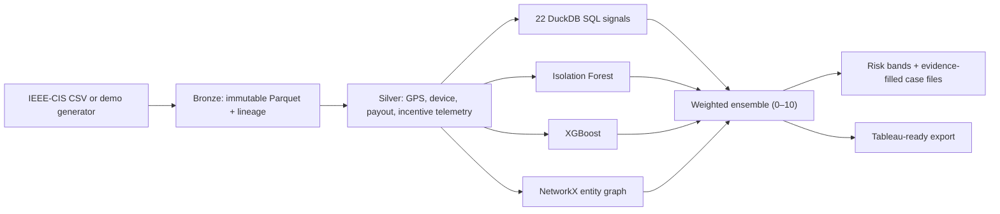
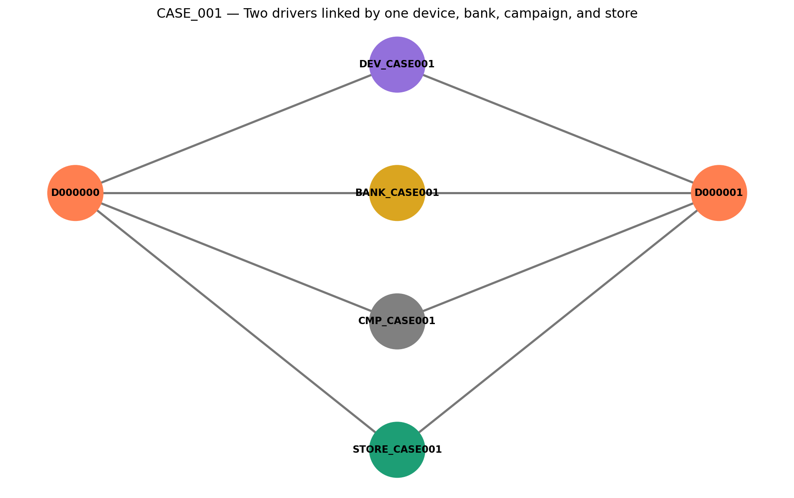

# Project Sentinel

An interview-ready, four-layer fraud-detection system for last-mile delivery. Sentinel combines deterministic SQL rules, Isolation Forest novelty detection, gradient-boosted classification, and shared-entity graph analysis to prioritize investigator-ready cases.

> This is a portfolio/reference implementation built on the public IEEE-CIS fraud target plus clearly labeled, deterministic synthetic delivery telemetry. It is not a Walmart system and makes no claim to use proprietary Walmart data.

## Architecture



## Quick start

```bash
python -m venv .venv
# Windows: .venv\Scripts\activate
# macOS/Linux: source .venv/bin/activate
pip install -r requirements.txt
python -m sentinel.demo
python -m sentinel.ingest
python -m sentinel.enrich
python run.py
```

For the full 590,540-row target, accept the [IEEE-CIS competition rules](https://www.kaggle.com/competitions/ieee-fraud-detection/data), place `train_transaction.csv` and `train_identity.csv` in `data/raw/`, and start at ingestion.

## Detection layers

| Layer | Purpose | Output |
|---|---|---|
| SQL | Explainable, threshold-based controls | 25 named driver signals |
| Isolation Forest | Previously unseen behavior | normalized novelty score |
| XGBoost | Supervised fraud propensity | calibrated ranking probability |
| Entity graph | Coordinated multi-account behavior | shared device/bank/IP ring flag |

The blend weights are 45% XGBoost, 25% anomaly, 20% SQL, and 10% graph. Ring members receive a 1.4× multiplier, with the final score capped at 10.

## Signal library

The 25 version-controlled queries under `sql/signals/` cover GPS spoofing, geofence misses, emulator/rooted devices, shared devices and payouts, refund velocity, incentive gaming, off-hours activity, distance and amount anomalies, store concentration, device hopping, shared IPs, payout changes, bot-assisted batch grabbing, device forensics, and composite risk. Each query is independently executable in DuckDB.

## Results and honest benchmarking

`python run.py` writes the local run's exact AUC-ROC, AUC-PR, row count, and fraud rate to `data/models/metrics.json`. Demo metrics validate execution but are not presented as a production benchmark because synthetic telemetry deliberately separates classes. The reference IEEE-CIS target in the project brief is 0.918 ROC-AUC / 0.891 PR-AUC; reproduce it only with the competition data and documented feature/training setup.

## Investigation workflow

CRITICAL and CRITICAL+ records generate pre-populated Markdown case files with all four layer scores, top model drivers, cross-role collusion evidence, recommended action, an investigator checklist, and a resolution section. Case generation is capped at 25 per run to model an operational review queue.

### CASE_001: coordinated account infrastructure



The reviewer-visible [CASE_001](cases/CASE_001.md) shows two driver accounts converging on one
device, payout account, and incentive campaign. This illustrates the graph layer’s core advantage:
coordination becomes visible even when individual trip rows appear plausible.

## Notebooks and dashboard

- `notebooks/01_eda.ipynb`: imbalance, amount, device, correlation, and GPS analysis.
- `notebooks/04_ml_model.ipynb`: local metrics, reference comparison, and feature importance.
- `notebooks/05_graph_analysis.ipynb`: ring ranking, size distribution, and entity graph.
- `dashboards/tableau_spec.md`: four-sheet Tableau build specification.

Run `python scripts/create_notebooks.py` to rebuild notebooks. Generated data/model artifacts are intentionally ignored by Git.

## Job-description traceability

| Capability | Evidence |
|---|---|
| Complex SQL and fraud controls | 22 DuckDB signals plus cross-role risk view |
| Python risk analytics | reproducible ingestion, enrichment, modeling, scoring |
| Anomaly and supervised ML | Isolation Forest + XGBoost with recorded metrics |
| Network/ring analysis | typed shared-entity graph and GraphML output |
| Investigator enablement | evidence-filled case files and risk-band routing |
| BI communication | Tableau-ready CSV, dashboard spec, notebooks |
| Auditability | immutable bronze output, SHA-256 lineage, versioned rules |

See [Operational risk and defensibility](docs/OPERATIONAL_RISK.md) for the
human-review model, control ownership, monitoring requirements, and production safeguards.

## Streaming extension

The batch interfaces map cleanly to Kafka/Flink: key telemetry by `driver_id`, maintain time-windowed signal state, materialize entity edges incrementally, and send scored events to a review queue. Thresholds and adverse-action decisions should remain human-governed, monitored for drift and disparate impact, and validated against real operational labels.

## Responsible use

Synthetic fields are marked in code and should never be mistaken for observed facts. A high score is an investigation priority—not proof of fraud. Production deployment requires privacy review, access controls, fairness testing, appeal pathways, and threshold calibration on representative data.
