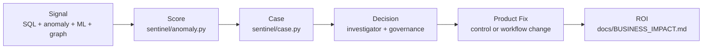

# Project Sentinel — Four-layer Spark Driver Fraud Detection System

[Explore the interactive portfolio](https://dev00amk.github.io/four-layer-detection-system-/) · [Run the demo](docs/DEMO_WALKTHROUGH.md) · [Inspect CASE_001](cases/CASE_001.md)

Portfolio implementation of last-mile fraud analytics: behavioral signals, anomaly detection,
entity analysis, structured enrichment, and reviewable case documentation.

## Executive summary

Project Sentinel turns last-mile delivery telemetry into prioritized fraud-review cases.
It combines four detection layers: 25 explainable SQL signals, Isolation Forest anomaly
detection, XGBoost with SHAP explanations, and a shared-entity graph. Together they address
six fraud families: GPS spoofing, bot-assisted offer grabbing, coordinated rings, incentive
abuse, account takeover and payout mules, and refund or delivery fraud. Run the complete
credential-free demonstration with `python run.py full`. Sentinel is a trust decision system,
It connects evidence, scoring, investigator review, and proposed product controls.
Validation uses IEEE-CIS data plus clearly labeled,
deterministic synthetic delivery telemetry; production use requires recalibration on labeled
operational data.



The value loop moves from governed detection evidence to a human decision, then feeds
preventive product controls and the scenario-based preventable-loss model.

### Read this in 90 seconds

- [Run the end-to-end demo](docs/DEMO_WALKTHROUGH.md)
- [Review the preventable-loss and ROI model](docs/BUSINESS_IMPACT.md)
- [Inspect the canonical coordinated-ring case](cases/CASE_001.md)
- [Map role requirements to repository evidence](https://dev00amk.github.io/four-layer-detection-system-/#skills)

> A reproducible portfolio study of mixed-signal fraud analysis, false-positive controls,
> structured investigation, and cross-functional reporting.

Sentinel converts synthetic Last-Mile Delivery (LMD) telemetry into prioritized review cases
for GPS spoofing, bot-assisted offer grabbing, coordinated rings, payout abuse, and related
patterns. Generated case files preserve the evidence used by the demo and provide a starting
point for analyst, Legal, or Compliance review. They are not substitutes for production
investigation records or legal conclusions.

> This is a portfolio/reference implementation built on the public IEEE-CIS fraud dataset plus clearly labelled, deterministic synthetic delivery telemetry, representative of gig-economy contractor operations.

---

## Business Impact & Operational Risk Controls

Sentinel is engineered around five enterprise risk outcomes common to last-mile delivery fraud prevention, financial institution fraud operations, and trust & safety functions at scale:

| Outcome | Enterprise Control Design | Repo Location |
|---|---|---|
| **Fraud Loss Reduction** | GPS spoofing, payout abuse, and incentive gaming surfaced into CRITICAL risk bands and prioritised review queues before settlement — targeting the highest-loss attack families with a quantified, six-family loss model | `sentinel/anomaly.py`, `docs/BUSINESS_IMPACT.md` |
| **False-Positive Control** | Every signal documents FP risk, mitigation rationale, and threshold justification; four structured FP exclusion paths require analyst sign-off before any adverse action is taken — protecting contractor fairness and reducing wrongful-deactivation liability | `sql/signals/` headers, `sentinel/case.py` |
| **Queue Prioritisation** | 25-case cap per run models realistic investigator capacity; CRITICAL and CRITICAL+ cases are auto-generated with pre-filled evidence, enabling time-to-action optimisation and workload governance | `sentinel/case.py`, `cases/` |
| **OSINT & Identity Verification** | Five-step structured OSINT enrichment (identity document, device intelligence, address type, account resale, contractor presence) produces audit-hashed, step-level evidence embedded directly in each case file | `sentinel/osint.py` |
| **Governance & Traceability** | Bronze-layer checksums, version-controlled signals, and integrity-hashed Markdown case files preserve the demo's evidence path from raw event through reviewer decision | `sentinel/ingest.py`, `data/bronze/lineage.json` |

---

## Impact Metrics

### Fraud and Trust Outcomes

- **Fraud Loss Reduction:** GPS spoofing, payout abuse, and incentive gaming are prioritised into CRITICAL risk bands and review queues, targeting the highest-loss attack families before settlement. A quantified loss model spans all six attack families: `docs/BUSINESS_IMPACT.md`.
- **False-Positive Control:** Ensemble weights, rule thresholds, and OSINT enrichment are each documented with FP risk and mitigation strategy, aligning with trust, fairness, and adverse-action compliance expectations for gig-economy contractor operations.

### Detection Quality and Operations

- **Model Performance:** Logs AUC-ROC, AUC-PR, row count, and fraud rate to `data/models/metrics.json` on every run for ongoing detection quality monitoring and model governance.
- **Case Queue Throughput:** Caps CRITICAL case generation at 25 per run to model realistic investigator workload and optimise time-to-action across operational cycles.

### Behavioural and OSINT Coverage

- **Behavioural Coverage:** 25 SQL signals target GPS spoofing, geofence misses, emulator and rooted devices, shared devices and payouts, refund velocity, incentive gaming, off-hours activity, bot-assisted batch grabbing, device forensics, device hopping, shared IPs, payout changes, and composite risk.
- **OSINT Enrichment:** Structured five-step external verification (identity document, device intelligence, address type, account resale detection, contractor presence) produces audit-hashed evidence embedded directly in each case file. Module: `sentinel/osint.py`.

### Governance, Audit, and Data Quality

- **End-to-End Lineage:** Immutable bronze outputs, SHA-256 lineage chains, version-controlled signals, and Markdown case files ensure every adverse action is traceable from raw event to investigator decision.
- **Governance and Failure Modes:** Documented signal prioritisation, operational risk framework, and failure-mode analysis provide the foundation for rule and model calibration, ethical deployment, and regulatory defensibility. See `docs/FAILURE_MODE_ANALYSIS.md`.

---

## Core Enterprise Capabilities

Sentinel is organized as a collection of independently testable portfolio modules. The
interfaces illustrate how comparable components could be integrated into a production risk
platform after validation on representative operational data.

**Behavioral Segmentation Engine — 25 DuckDB Signals**
A library of 25 version-controlled SQL queries covering the full LMD contractor fraud surface: GPS impossible-transit detection, geofence miss analysis, emulator and rooted-device fingerprinting, shared-device and shared-payout clustering, refund velocity controls, incentive gaming identification, off-hours behavioral profiling, bot-assisted batch-grabbing detection, device forensics, device hopping, shared-IP clustering, payout-change velocity, and composite risk scoring. Every signal carries documented fraud type, FP risk classification, mitigation strategy, and threshold rationale — enabling defensible, auditable rule governance at scale.

**Unsupervised Anomaly Detection — Isolation Forest**
A novelty-detection layer targeting previously unseen behavioral patterns not yet codified in rule logic. Produces a normalised anomaly score that feeds directly into the ensemble blend, providing continuous coverage against emerging fraud typologies without requiring labelled training data for each new pattern.

**Supervised Fraud Propensity Model — XGBoost with SHAP Explainability**
An XGBoost classifier producing per-row fraud probability scores, with SHAP feature
contributions embedded in generated case files. In the demo, these explanations help a
reviewer understand model behavior; they do not independently justify an adverse action.

**Entity Graph — Coordinated Multi-Account Ring Detection**
A graph-based collusion-detection layer that identifies coordinated infrastructure across contractor accounts through shared device, shared bank account, shared store concentration, and shared incentive campaign edges. Ring membership triggers a proportional composite-score multiplier (1.2× for a 2-contractor pair, up to 1.5× for a 5+ contractor ring, capped at 10). IP-cluster edges are excluded from ring detection to prevent carrier NAT false positives.

**Mixed-Signal Decisioning — Calibrated Ensemble Blend**
A weighted ensemble combining all four detection layers: XGBoost 45%, Isolation Forest 25%, SQL signals 20%, entity graph 10%. The blend is designed to balance precision-recall trade-offs across fraud families, with ring multipliers applied post-blend to amplify coordinated-abuse signals without distorting single-account scores.

**Audit-Ready Case Management — SHA-256 Integrity-Hashed Evidence Packs**
Every CRITICAL and CRITICAL+ contractor record triggers a structured Markdown case file
containing layer scores, SHAP feature contributions, graph evidence, simulated enrichment,
a false-positive checklist, a recommended next step, and an integrity hash. A production
case would still require source verification, analyst review, access controls, and the
organization's approved Legal or Compliance workflow.

**Structured OSINT Enrichment Pipeline — Five-Step Identity Verification**
A modular enrichment pipeline covering five verification dimensions: identity document
validation, device intelligence, address type classification, account-resale detection, and
contractor-presence verification. Portfolio mode uses deterministic simulation; approved
vendors, privacy review, and source verification are required for operational use.

**Immutable Data Lineage — Bronze-Layer Architecture with SHA-256 Chain**
An end-to-end lineage architecture ensuring every scored record is traceable from raw ingestion event through enrichment, signal firing, model scoring, ensemble blend, and case generation. SHA-256 checksums at each stage create an immutable audit chain suitable for regulatory review, internal audit, and legal proceedings.

**Cross-Functional Stakeholder Reporting**
Structured briefing documents for four stakeholder audiences — Product, Legal, Engineering, and Care Operations — translating detection outputs into audience-appropriate operational narratives. Designed to support cross-functional escalation, program ownership communication, and executive risk reporting.

---

## Architecture

```
Raw Telemetry (LMD Contractor Events)
        │
        ▼
┌─────────────────┐
│  Bronze Ingest  │  Immutable Parquet + SHA-256 lineage
└────────┬────────┘
         │
         ▼
┌─────────────────┐
│   Enrichment    │  Feature engineering + OSINT verification
└────────┬────────┘
         │
    ┌────┴────┐
    │         │
    ▼         ▼
SQL Signals  ML Models (Isolation Forest + XGBoost + Graph)
    │         │
    └────┬────┘
         │
         ▼
┌─────────────────┐
│ Ensemble Blend  │  Weighted composite score + ring multiplier
└────────┬────────┘
         │
         ▼
┌─────────────────┐
│  Case Manager   │  CRITICAL/CRITICAL+ → SHA-256 hashed evidence packs
└─────────────────┘
```

---

## Quick Start

```bash
python -m venv .venv
source .venv/bin/activate   # Windows: .venv\Scripts\activate
pip install -r requirements.txt
copy .env.example .env           # Windows; use `cp` on macOS/Linux
python run.py full               # credential-free 12,000-row demonstration
```

The CLI also exposes independently restartable phases:

```text
python run.py demo [--rows N] [--seed N]  Generate deterministic source CSVs
python run.py ingest                       Validate and write immutable bronze
python run.py enrich                       Validate and write delivery telemetry
python run.py score                        Build graph, train models, and score
python run.py cases                        Generate the bounded case queue
python run.py report                       Write investigator feedback metrics
python run.py full                         Execute the complete local workflow
```

For the full 590,540-row dataset, accept the IEEE-CIS competition rules, place `train_transaction.csv` and `train_identity.csv` in `data/raw/`, and start at ingestion.

---

## Detection Layers

| Layer | Purpose | Output |
|---|---|---|
| **SQL Signals** | Explainable, threshold-based controls with documented FP risk | 25 named contractor signals |
| **Isolation Forest** | Previously unseen behaviour — catches novel patterns not yet in rules | Normalised novelty score |
| **XGBoost** | Supervised fraud propensity with per-row SHAP explanations | Calibrated probability |
| **Entity Graph** | Coordinated multi-account behaviour via shared device, bank, store | Ring flag + ring size |

Blend weights: XGBoost 45%, Isolation Forest 25%, SQL 20%, graph 10%. Ring members receive a proportional multiplier (1.2× for a 2-contractor pair, up to 1.5× for a 5+ contractor ring), capped at 10. IP cluster edges are excluded from ring detection to prevent carrier NAT false positives.

Three narrowly defined fatal-tier controls—impossible travel above 300 km/h,
simultaneous emulator/root/mock-GPS evidence, and payout redirection from a
new device—route directly to CRITICAL+ review. This controls queue priority,
never automated adverse action. Behavioral features use 7-, 30-, and 90-day
windows with trend deltas, and Pydantic contracts validate bronze and silver
dataset boundaries.

---

## Signal Library

The 25 version-controlled queries in `sql/signals/` cover GPS spoofing and impossible transit, geofence misses, emulator and rooted devices, shared devices and payouts, refund velocity, incentive gaming, off-hours activity, trip distance and amount anomalies, store concentration, device hopping, shared IPs, payout changes, bot-assisted batch grabbing, device forensics, account hopping, and composite risk. Each query documents its fraud type, FP risk, mitigation, and threshold rationale.

Signal triage framework (protect / tune / monitor / sunset): `docs/SIGNAL_PRIORITIZATION.md`.

---

## Results and Honest Benchmarking

`python run.py` writes AUC-ROC, AUC-PR, row count, and fraud rate to `data/models/metrics.json`. Demo metrics validate execution but are not presented as a production benchmark — synthetic telemetry deliberately separates fraud from legitimate classes to enable demonstration without real operational data. The reference IEEE-CIS target is 0.918 ROC-AUC / 0.891 PR-AUC; reproduce it only with the competition dataset and the documented feature and training setup.

---

## Investigation Workflow

CRITICAL and CRITICAL+ contractors generate pre-populated Markdown case files containing: all four layer scores, SHAP top-5 feature contributions, cross-role collusion evidence, a five-step OSINT enrichment table with audit-hashed evidence records, a false-positive exclusion checklist (four named paths requiring analyst sign-off), recommended action, and an SHA-256 integrity hash. Case generation is capped at 25 per run to model a realistic investigator queue.

### CASE_001 — Coordinated Account Infrastructure

`cases/CASE_001.md` demonstrates two contractor accounts converging on one device, one payout account, one incentive campaign, and one store. Coordination becomes visible even when individual trip rows appear individually plausible — the graph layer's core advantage and primary value-add over purely row-level detection.

### Sample Output — CASE_001 Composite Score

| Layer | Score | Threshold | Status |
|---|---|---|---|
| SQL Signals | 12/25 signals fired | > 5 | ✓ |
| Isolation Forest | 0.681 anomaly score | > 0.60 | ✓ |
| XGBoost | 1.000 demo probability | > 0.50 | ✓ |
| Graph Ring | Member — 2-contractor ring (1.2× multiplier) | flag = 1 | ✓ |
| **Composite** | **10 / 10 — CRITICAL+ demo case** | ≥ 7 | ✓ |

These values come from a deliberately separable synthetic scenario and demonstrate execution,
not expected production discrimination.

### Sample Output — metrics.json (Demo Run)

```json
{
  "auc_roc": 1.0,
  "auc_pr": 1.0,
  "rows": 12000,
  "fraud_rate": 0.03383333333333333
}
```

The perfect demo metrics result from deliberately separable synthetic features. They confirm
that the pipeline runs; they are not a benchmark or forecast of production performance.

---

## Notebooks and Dashboard

- `notebooks/01_eda.ipynb` — class imbalance, GPS anomaly scatter, correlation heatmap
- `notebooks/04_ml_model.ipynb` — AUC metrics, SHAP summary plot, benchmark comparison
- `notebooks/05_graph_analysis.ipynb` — ring ranking, size distribution, CASE_001 graph
- `dashboards/tableau_spec.md` — four-sheet Tableau build specification

Run `python scripts/create_notebooks.py` to rebuild notebooks. Generated data and model artifacts are excluded from version control.

---

## Documentation Index

| Document | Purpose |
|----------|---------|
| [`docs/DEPARTMENT_CORE_MANDATE.md`](docs/DEPARTMENT_CORE_MANDATE.md) | Strategic mandate for LMD Fraud Prevention: infrastructure defense, ROI, low-friction integrity, and OODA operating model |
| [`docs/OPERATIONAL_RISK.md`](docs/OPERATIONAL_RISK.md) | Human-in-the-loop routing, auditability design, control ownership |
| [`docs/BUSINESS_IMPACT.md`](docs/BUSINESS_IMPACT.md) | Quantified loss model for 6 attack families, ROI at 3 loss-pool sizes |
| [`docs/SIGNAL_PRIORITIZATION.md`](docs/SIGNAL_PRIORITIZATION.md) | 3-axis triage framework (yield × FP cost × business impact) for all 25 signals |
| [`docs/CROSS_FUNCTIONAL_BRIEFING.md`](docs/CROSS_FUNCTIONAL_BRIEFING.md) | 4 stakeholder briefings: Product, Legal, Engineering, Care Operations |
| [`docs/FAILURE_MODE_ANALYSIS.md`](docs/FAILURE_MODE_ANALYSIS.md) | 6 failure modes with detection lag, early warning indicators, mitigation |
| [`docs/PLATFORM_EQUIVALENCE.md`](docs/PLATFORM_EQUIVALENCE.md) | Maps Sentinel to NICE Actimize, Pega, Salesforce FSC, Unit21 |
| [`docs/DETECTION_STRATEGY.md`](docs/DETECTION_STRATEGY.md) | Detection thresholds, evidence standards, false-positive controls, economics, and monitoring |
| [`docs/FRAUD_TECHNIQUES.md`](docs/FRAUD_TECHNIQUES.md) | Fraud technique library, kill chain, lifecycle mapping, and signal coverage |
| [`docs/GOVERNANCE.md`](docs/GOVERNANCE.md) | Risk appetite, action standards, appeals, escalation, QA, and model governance |
| [`docs/INVESTIGATOR_PLAYBOOK.md`](docs/INVESTIGATOR_PLAYBOOK.md) | Eight-step investigation SOP from intake through escalation and case closure |
| [`docs/DECISION_LOG.md`](docs/DECISION_LOG.md) | Material program decisions, alternatives, tradeoffs, rationale, and monitoring plans |

---

## Streaming Extension

The batch interfaces map cleanly to Kafka and Flink: key telemetry by `contractor_id`, maintain time-windowed signal state, materialise entity edges incrementally, and send scored events to a review queue. The three highest-value signals (GPS impossible transit, shared device, shared payout) are the priority streaming candidates — catching them before payout settlement is 3–5× more valuable than post-settlement detection. Thresholds and adverse-action decisions must remain human-governed, monitored for drift and disparate impact, and validated against real operational labels.

---

## Configuration, quality gates, and production migration

Runtime behavior is configured through [`.env.example`](.env.example).
`OSINT_MODE=sim` is the safe default and makes no external requests.
`OSINT_MODE=live` fails closed unless approved vendor credentials are present;
the included adapters are generic seams requiring vendor-contract validation.

Every CLI phase emits JSON logs with run and driver correlation IDs. CI runs
Ruff, mypy, coverage-enforced tests, and the end-to-end demo on Python 3.10
and 3.11.

```bash
ruff check sentinel tests run.py
mypy sentinel run.py
pytest
```

Before operational use, replace synthetic telemetry and IEEE-CIS abstractions,
validate vendor contracts, calibrate thresholds on representative labels,
complete privacy/fairness review, configure secrets outside the repository,
and connect investigator dispositions through `sentinel/feedback.py`.

Contributions should be small, tested, and include threshold rationale and
false-positive impact when detection logic changes.

---

## Responsible Use

Synthetic fields are marked in code and must never be treated as observed facts. A high composite score is an investigation priority, not proof of fraud. Production deployment requires privacy review, least-privilege access controls, fairness testing across protected-class proxies, appeal pathways for every adverse action, and threshold calibration on representative operational data.
