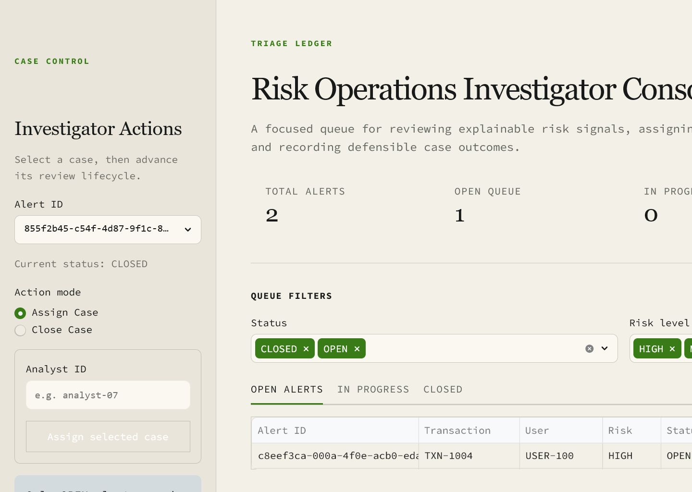
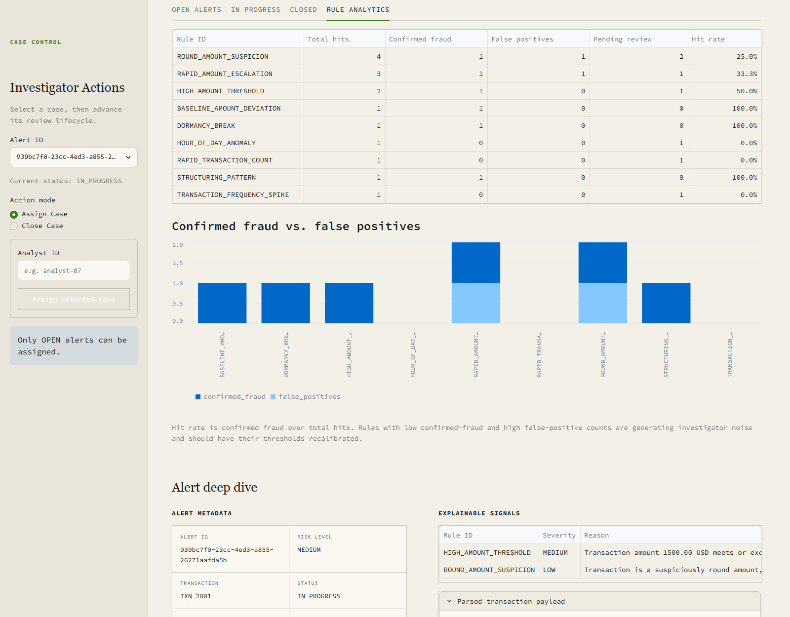

# Lightweight Four-Layer Transaction Detection Prototype

- Self-contained fraud/risk operations prototype: transactions in, explainable
  alerts out, investigator workflow and rule-effectiveness analytics on top.
- Backend is pure Python 3.10+ standard library; Streamlit + pandas are used
  only for the dashboard layer.
- What's special: behavioral rules and per-user baselines instead of fixed
  thresholds alone, plus a closed feedback loop — every closed case updates
  per-rule confirmed-fraud and false-positive metrics.
- 42 unit tests, run warning-strict in CI across multiple Python versions.

```text
JSON transactions
      |
Layer 1 - Validation / Normalization        src/layer1_ingestion/
      |
Layer 2 - Behavioral Rules                  src/layer2_heuristics/
      |   (velocity, amount, dormancy, structuring, escalation, round amounts)
Layer 3 - Baseline Features                 src/layer3_ml/
      |   (z-scores, off-hours activity, frequency spikes)
Layer 4 - SQLite Alerts + Rule Analytics    src/layer4_orchestration/
      |
Streamlit - Triage Ledger Dashboard         dashboard.py
          (queue tabs, case actions, Rule Analytics)
```

This prototype complements the repository's full Spark Driver fraud pipeline.
It is intentionally small enough to review in one sitting.

## Try it in 60 seconds

```bash
cd prototypes/four-layer-detection-system
pip install -r requirements.txt
python main.py               # generate sample alerts
streamlit run dashboard.py
```

Open the **Rule Analytics** tab to see which rules are actually catching
fraud versus generating noise.

`main.py` creates `risk_alerts.db`, processes the sample transactions, and
prints the normalized alerts. Every signal includes a stable rule ID,
severity, reason, and supporting metadata. Transaction IDs are unique at the
database boundary, so rerunning the sample skips existing alerts instead of
duplicating cases.

## Detection content

Layer 2 deterministic rules (`src/layer2_heuristics/rules.py`), each
individually callable with `(transaction, user_history)`:

| Rule ID | Severity | Trigger |
| --- | --- | --- |
| `RAPID_TRANSACTION_COUNT` | HIGH | More than 3 transactions within a 10-minute window |
| `HIGH_AMOUNT_THRESHOLD` | MEDIUM | Amount at or above the fixed 1,000.00 threshold |
| `DORMANCY_BREAK` | HIGH | First transaction above 200.00 after more than 45 days of inactivity |
| `STRUCTURING_PATTERN` | HIGH | 5+ transactions each below 1,000.00 aggregating above 3,500.00 within 72 hours |
| `RAPID_AMOUNT_ESCALATION` | MEDIUM | Amount more than 4.0x the user's historical mean (3+ prior transactions) |
| `ROUND_AMOUNT_SUSPICION` | LOW | Round amount (multiple of 500) at or above 500.00 |

Layer 3 per-user statistical baseline features (`src/layer3_ml/features.py`)
emit LOW-severity context signals: `BASELINE_AMOUNT_DEVIATION` (amount beyond
2.5 standard deviations of the user's baseline), `HOUR_OF_DAY_ANOMALY` (first
activity in the overnight 00:00-05:59 UTC band), and
`TRANSACTION_FREQUENCY_SPIKE` (more than 5 transactions within 24 hours).
All thresholds live in `config.py`.

## Investigator workflow

```python
from src.layer4_orchestration.case_workflow import assign_alert, close_alert

assign_alert("alert-id", "analyst-7")
close_alert("alert-id", "CONFIRMED_FRAUD", "Evidence reviewed and documented.")
```

Assignment is allowed only from `OPEN`. Closure is allowed from `OPEN` or
`IN_PROGRESS`, and records an ISO-8601 UTC review timestamp.

## Dashboard

The Streamlit investigator console adds queue metrics, status and risk filters,
explainable signal review, transaction payload inspection, and guarded
assignment and closure actions on top of the existing SQLite workflow. A
Rule Analytics tab closes the feedback loop: every signal writes a row into
the `rule_analytics` table, closing a case stamps those rows with the final
disposition, and the tab summarizes total hits, confirmed fraud, false
positives, pending reviews, and hit rate per rule — making noisy rules that
need recalibration immediately visible
(`src/layer4_orchestration/rule_analytics.py`, stdlib-only and unit-tested).

The dashboard reads `risk_alerts.db` directly and uses the existing
`assign_alert()` and `close_alert()` functions for lifecycle updates.





## Example investigation: TXN-8006

A complete review cycle, start to finish:

1. Run `python main.py`. It processes the sample batch and persists 9
   alerts — every rule and baseline feature fires at least once.
2. Start the dashboard and pick the `TXN-8006` alert from the **Alert ID**
   selector in the sidebar. The **Explainable signals** panel shows a
   5,000.00 payment from a user whose baseline is ~100.00, explained by four
   plain-English signals: high amount, 50x the user's historical mean, a
   suspiciously round amount, and an extreme z-score against the user's own
   baseline.
3. In the sidebar, keep **Action mode** on *Assign Case*, enter an analyst
   ID, and submit. The alert moves to `IN_PROGRESS` and appears under the
   **In Progress** queue tab.
4. Switch **Action mode** to *Close Case*, choose the `CONFIRMED_FRAUD`
   disposition, add a short evidence note, and submit. The closure
   atomically stamps the alert's `rule_analytics` rows with the disposition
   and review timestamp.
5. Open the **Rule Analytics** tab: every rule that fired on the alert now
   counts one confirmed-fraud outcome, and its hit rate updates.
6. Repeat over the queue and the tab becomes a tuning report: rules with
   high false-positive counts and low hit rates are the ones to recalibrate
   in `config.py`.

## Development notes

- Tests (matches the CI invocation):

  ```bash
  python -W error::ResourceWarning -m unittest discover -s tests -v
  ```

- Reset the demo database:

  ```bash
  rm risk_alerts.db   # PowerShell: Remove-Item risk_alerts.db
  python main.py
  ```
